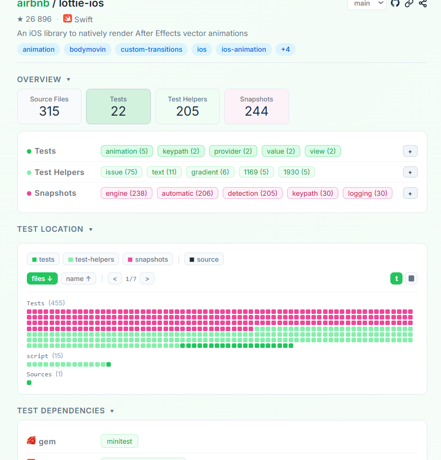
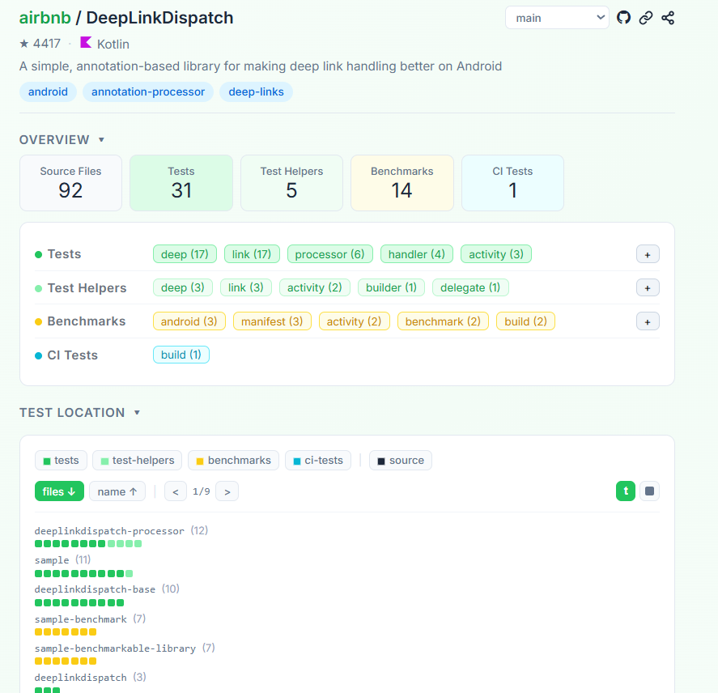

# Explorando Práticas de Teste

Neste exercício, vamos explorar práticas de teste em sistemas reais utilizando a ferramenta [TestMiner](https://andrehora.github.io/testminer).

O TestMiner permite visualizar e analisar testes de software em repositórios do GitHub, fornecendo dados sobre como os projetos organizam seus testes, como eles evoluem entre versões e quais bibliotecas de teste são utilizadas.
Explore a ferramenta antes de começar para se familiarizar com seu funcionamento.

Mais detalhes no GitHub da ferramenta: https://github.com/andrehora/testminer.

---

## Passo 1: Selecionar DOIS repositórios

Escolha dois repositórios reais que possuam testes de software.
Abaixo estão alguns links para ajudá-lo a encontrar projetos interessantes:

- Python: https://github.com/topics/python?l=python
- JavaScript: https://github.com/topics/javascript?l=javascript
- TypeScript: https://github.com/topics/typescript?l=typescript
- Java: https://github.com/topics/java?l=java

- Tópicos: [ai](https://andrehora.github.io/testminer/#topic:ai), [llm](https://andrehora.github.io/testminer/#topic:llm), [api](https://andrehora.github.io/testminer/#topic:api), [nodejs](https://andrehora.github.io/testminer/#topic:nodejs), [android](https://andrehora.github.io/testminer/#topic:android)

- Por organização: [Google](https://andrehora.github.io/testminer/#google), [Microsoft](https://andrehora.github.io/testminer/#microsoft), [Apple](https://andrehora.github.io/testminer/#apple), [Facebook](https://andrehora.github.io/testminer/#facebook), [Netflix](https://andrehora.github.io/testminer/#netflix), 
[GitHub](https://andrehora.github.io/testminer/#github), [Apache](https://andrehora.github.io/testminer/#apache), [HuggingFace](https://andrehora.github.io/testminer/#huggingface)

## Passo 2: Explorar os repositórios selecionados

Busque os repositórios escolhidos no [TestMiner](https://andrehora.github.io/testminer) e analise os dados de teste gerados pela ferramenta.

## Passo 3: Explicar as prática de teste

Para cada repositório, escolha uma prática ou dado de teste relevante e explique com suas próprias palavras.

---

## Instruções de entrega

1. Faça um `fork` deste repositório (saiba mais sobre forks [aqui](https://docs.github.com/pt/pull-requests/collaborating-with-pull-requests/working-with-forks/fork-a-repo)).
2. Responda às questões abaixo diretamente neste arquivo `README.md` do seu fork. Pode adicionar imagens para enriquecer sua explicação.
3. No Moodle, submeta apenas a URL do seu fork.

---

## Respostas

### Repositório 1

- **Repositório:** https://github.com/airbnb/lottie-ios
- **URL TestMiner:** https://andrehora.github.io/testminer/#airbnb/lottie-ios

**Explicação:**

No `lottie-ios`, uma biblioteca que renderiza animações do After Effects
no iOS, escolhi analisar a prática de **teste de snapshot**. Segundo o
TestMiner, o projeto tem 315 arquivos de código-fonte e 244 arquivos de
snapshot, contra apenas 22 testes tradicionais e 205 test helpers.

Um teste de snapshot gera a saída do código e compara com uma imagem de
referência salva anteriormente. Se o resultado mudar, o teste falha, e o
desenvolvedor decide se foi um erro ou uma mudança intencional. Essa
prática combina bem com o projeto, porque o resultado de uma animação é
visual e seria difícil verificá-lo com asserts comuns. Os test helpers
provavelmente existem para carregar as animações e gerar os snapshots, o
que explica o número alto deles.

### Repositório 2

- **Repositório:** https://github.com/airbnb/DeepLinkDispatch
- **URL TestMiner:** https://andrehora.github.io/testminer/#airbnb/DeepLinkDispatch

**Explicação:**

O `DeepLinkDispatch` é uma biblioteca Android para tratar deep links
com anotações. Nele, escolhi analisar a prática de **benchmarks**.
O TestMiner mostra 14 arquivos de benchmark, ao lado de 31 testes
tradicionais e 92 arquivos de código-fonte.

Um benchmark é um teste que mede desempenho, e não se o resultado está
correto. Isso faz sentido numa biblioteca que resolve deep links dentro
de apps, porque lentidão nessa etapa afeta a experiência do usuário.

Na visão Test Location, os benchmarks ficam separados do resto, nos
módulos `sample-benchmark` e `sample-benchmarkable-library`, o que
mantém as medições de desempenho isoladas dos testes funcionais. No
Test History, os benchmarks passam de 0 na versão 3.0.0 para 14
na versão 5.4.3 e permanecem em 14 na 7.2.2. Isso indica que o projeto
passou a medir desempenho a partir de certo ponto e manteve esse
conjunto depois, enquanto a quantidade de testes funcionais continuou
crescendo (de 7 para 40). O número 31 do Overview e o 40 do histórico
vêm de visões diferentes (versão atual do `main` e releases).

